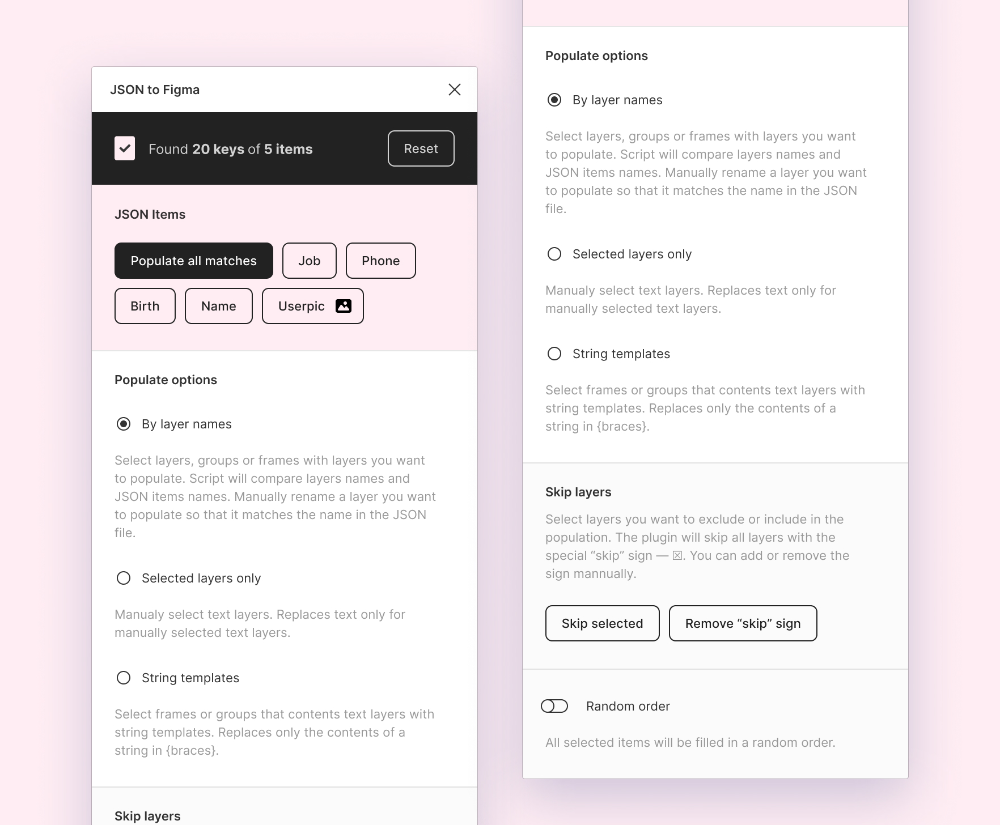
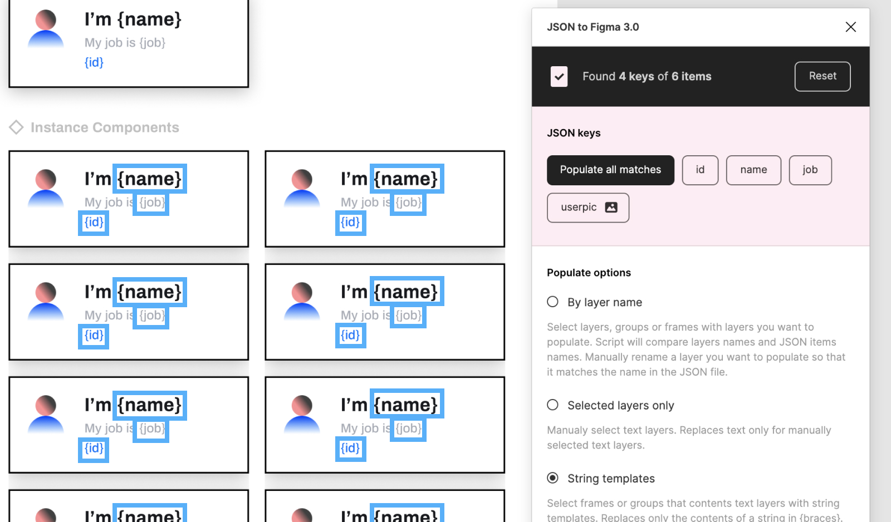
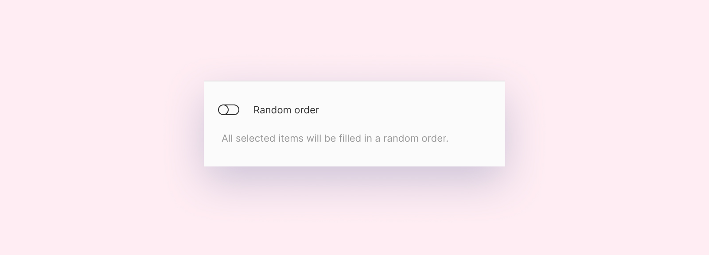
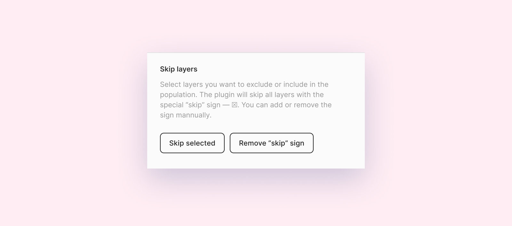
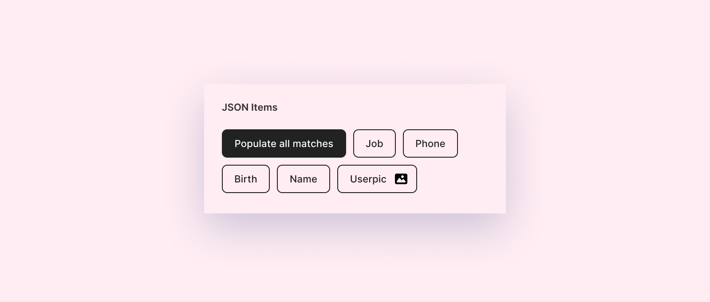

# JSON to Figma 3.0


##### An easy way to populate Figma layers with JSON.

The plugin can parse local or JSON files from URL link. You can populate text layers that you selected, or by name or string template.

---

### 💡 Features:

-   Load **loacl** files and fetch **from URL**
-   Fetch images images
-   Parsing of JSON files with **any amount of nested levels**
-   Popualte **all matches** only by one button
-   Three populate options — populate **`only selected layers`**, **`by layer name`**, **`by string templates`**
-   Popualte **by direct or random order**
-   the **"skip" rule** for layers you won't populate

---

### Get the plugin

##### 📥 [figma.com/community/plugin/789839703871161985/JSON-to-Figma](https://www.figma.com/community/plugin/789839703871161985/JSON-to-Figma)

### Youtube demo

##### 🎥 [youtu.be/7CKYdDfLFDY](https://youtu.be/7CKYdDfLFDY)

### Plugin guide in Figma

##### 🎀 [figma.com/file/dcOi6yAtkTQqxNGbLJQVPE/JSON-To-Figma-%E2%80%94-Plugin?node-id=1675%3A148](https://www.figma.com/file/dcOi6yAtkTQqxNGbLJQVPE/JSON-To-Figma-%E2%80%94-Plugin?node-id=1675%3A148)

---

## 🚀 How to Use

All you need is a proper JSON. The plugin will parse show all available keys from the JSON including nested layers. The plugin has three populate options and a few additional settings.



---

### ⚙️ Populate Options

#### 1. `By layer name`

You can populate layers deeply nested in any group or frame. To do so, manually rename the layer you want to populate so that it matches the name in the JSON file.
Not a case-sensitive method — a JSON item with a `job` name will be match to `Job` layer name.


#### 2. `Selected layers only`

Replaces text only for directly selected text layers.


**3. `String templates`** — Select frames or groups that content text layers with string templates. Replaces only the contents of a string in {braces}.



---

### 🎚 Additional options

**`Random order`** — If you switch it on all items will be filled in random order. By default, all your layers will be filled in order.



**`Skip marked layers`** — if you want to skip layers, groups or frames — exclude them from the list, then you can use the “Skip marked layers” option. Just select layers and press “Skip selected”. You can also clean marked layers or add the marker ^ manually.



**`Populate all matches`** — If you want to fill all your layers with all possible keys from the JSON at one — use this button. This option available for "String" and "By name" options.



**`Image URLs recognition`** — The plugin will automaticly recognise values from a JSON that end with .JPG, .PNG, .GIF or .WEBP as images. You can distinguish the value with the picture by the following buttons:


---

### ✅ The correct JSON structure

The better JSON structure for the file should look like an array of objects

```js
[
    {
        key_string: 'string #1',
        key_number: 0,
    },
    {
        key_string: 'string #2',
        key_number: 1,
    },
];

// As a result you will see buttons — `key_string`, `key_number`
```

##### ⚠️ Other JSON structures

But you also can use different JSON structures. For example:

```js
{
    "obj0": {
        "key_string": "string #1",
        "key_number": 0
    },
    "obj1": {
        "key_string": "string #2",
        "key_number": 1
    }
}

// As a result you will see buttons — `0`, `1.key_string`, `1.key_number`
```

---

### 📓 Services to generate JSON data

You can download try different JSON samples [from this repo](https://github.com/PavelLaptev/JSON-to-Figma-2.0-React/tree/master/json-test-files).

Or you can use on of these services:

-   [mockaroo.com](https://www.mockaroo.com/)
-   [next.json-generator.com](https://next.json-generator.com/EyLps-PPO?fbclid=IwAR0WGNKJMclqcS6qwRHj-NXOyF52BjQYJp9osgeWRmN2iCGZ47awnDDLhmI)
-   [jsonplaceholder.typicode.com](https://jsonplaceholder.typicode.com/)

---

### 🤙 Feedback

Please if you have any trubles with the plugin or ideas how I could improve the plugin, let me know here or by email 😊
